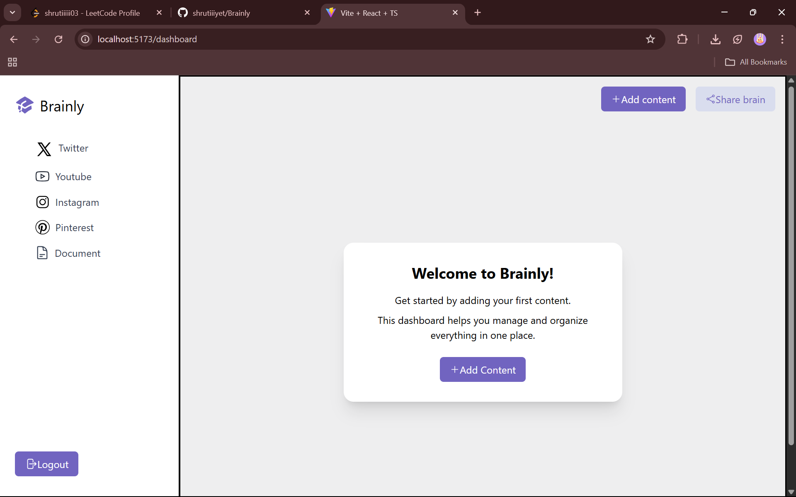
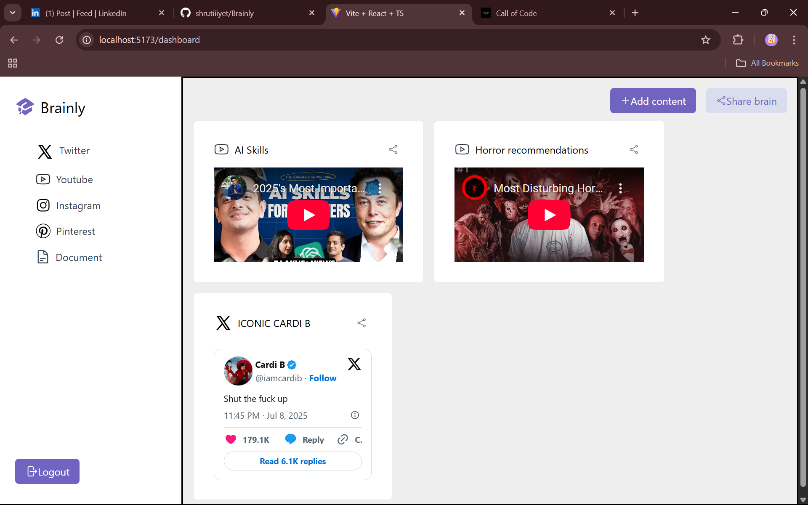
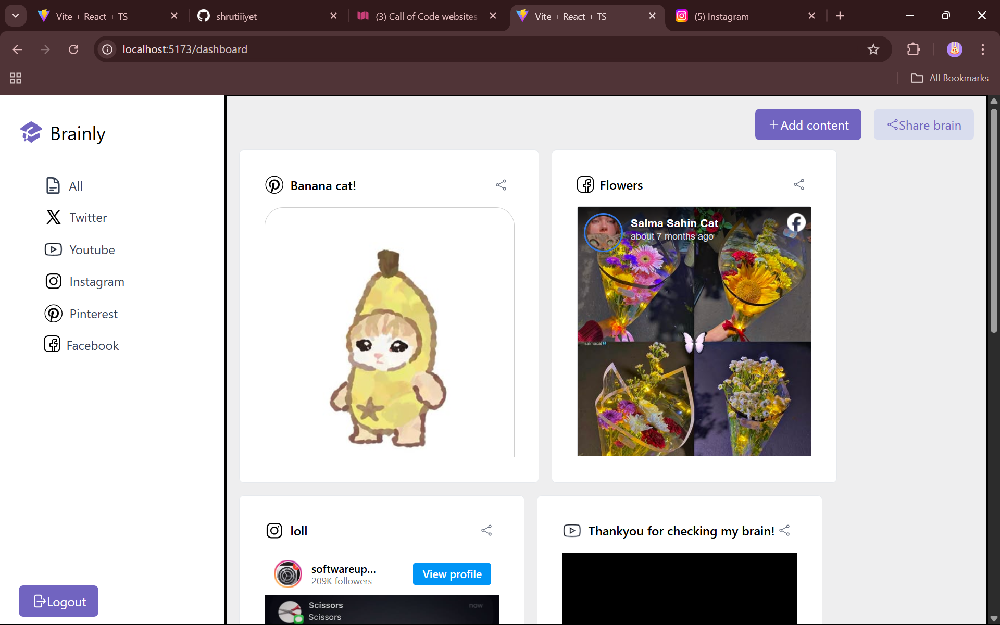

# 🧠 Brainly

**Brainly** is a minimalist full-stack web application built using **React + TypeScript** and **MongoDB**. It includes a custom-built UI component library and focuses on simplicity in both design and architecture.

---

## 🚀 Tech Stack

- **Frontend**: React, TypeScript
- **Backend**: Node.js, Express, MongoDB (NoSQL)
- **UI Library**: Built from scratch
- **Design Philosophy**: Clean, lightweight, and minimal

---

## ✨ Features

- Fully custom UI components – no external design libraries
- Minimalist UX with focus on performance
- Built with scalability in mind using a clean backend structure
- NoSQL database (MongoDB) integration with flexible schema design

---

## 🧠 What I Learned

- Deepened understanding of React with TypeScript
- Built a design system and reusable UI components from scratch
- Designed a backend that balances simplicity and modularity
- Gained experience working with MongoDB's flexible document structure

---

## 🛠️ Getting Started

### 1. Clone the Repository

- git clone https://github.com/shrutiiiyet/Brainly.git
- cd BRAINLY

### 2. Install dependencies

#### Frontend:
- cd brainly-fronted/brainly
- npm install

#### Backend
- cd ../brainly-backend
- npm install

### 3. Set environment variables

### 4. Run the project

---

## 📸 Screenshots

HomePage

Content

Dashboard

---

## ⭐️ Feedback & Contributions
- This is a personal learning project — feedback, suggestions, and PRs are welcome!

---

## 📄 License
MIT © Shruti Jadhav
